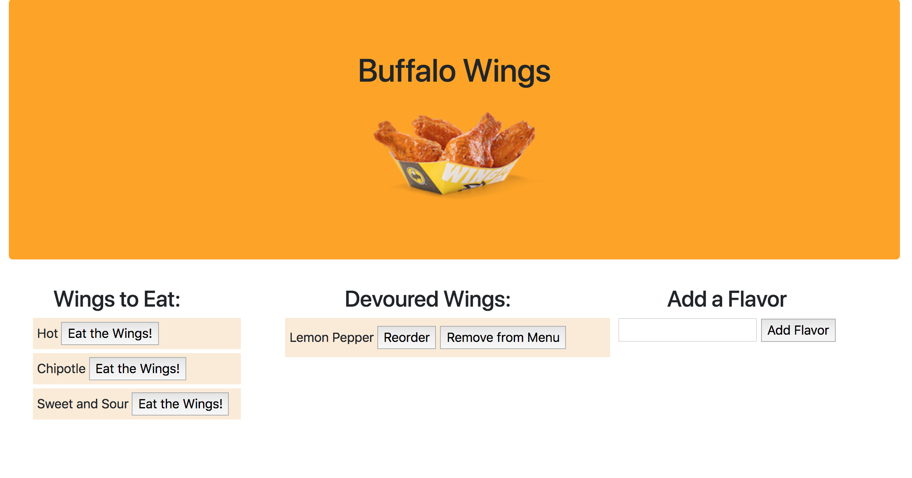

# Wings Chooser

Wings Chooser is an app that allows you to eat Buffalo Wings. It asks you to enter the flavor you want, then you can eat, reorder, or remove the flavor from the menu.

This project shows use of the MVC software architecture pattern using node, express, handlebars, and mySQL. It uses REST API methods GET, POST, PUT, and DELETE to handle user inputs and communication with the database.

Visit the Wings Chooser at: [Wings Chooser](https://lit-shore-57043.herokuapp.com/)

